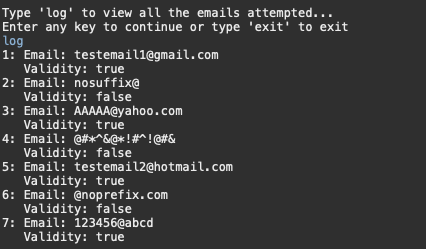

# Validation of an Email ID

This program validates user inputted e-mail IDs allowing for non case sensitive alphabet, integers ranging from 0 to 9, and special characters _ - and .

## Features

	- Takes in multiple emails at one time
	- Validates emails with immediate output
	- Logs the validation of each email 

## Installation

	- Clone and pull source code from provided github repository
	- Compile source code with Java Compiler
	- Run with Java Runtime Environment

## Code

	https://github.com/salabha77/Validation-of-an-Email-ID

## Usage
	Once run, the console will welcome and prompt the user for the email IDs that they wish to validate

	The console will then output each email ID with their corresponding validation values

	
	Following, the user will be asked if they want access the log of all emails that were processed by typing 'log', if they wish to continue inputting email IDs to be validated by typing any letter, or exit by typing 'exit'

	If user enters 'log' the log will be output on the console

